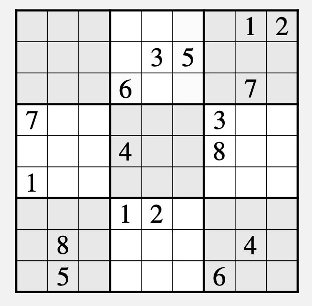

# Sudoku solver

This application solves a given Sudoku puzzle using backtracking.

## Implemented Heuristics

Currently the app implements the following heuristics:

- simple row, column, and 3x3 subgrid inconsistency check
- Minumum Remaining Values (MRV): prefer the cells with the fewest remaining candidates, reducing chance of picking a wrong value
- Constraint Propagation: entering a value into a cell removes that value from the candidate sets of connected cells

## Performance

The app currently solves this puzzle of hard difficulty in 33041 steps.

**Puzzle source:**
Skiena, S. S. (2008). _The Algorithm Design Manual._ Springer Science & Business Media, 2 edition.

## Next steps

The next improvements that make sense to implement are for instance:

 - row, column and 3x3 cover elemination ([read more](https://sandiway.arizona.edu/sudoku/cover.html))
 - Least Constraining Value (LCV): select the candidate for a cell that impacts the fewest candidate sets of connected cells, reducing the chance of eliminating a correct candidate
 - Other various tricks one might use when solving a sudoku puzzle manually, for example:
   - candidate uniqueness -> when a candidate only occurs once in a row/column/subgrid, it can be entered directly
   - obvious pairs/triples --> when 2 or 3 cells contain exactly 2 or 3 unique candidates, these candidates must occur in this group of cells and can be removed from any other cell connected to that group
   - hidden pairs/triples --> when a set of candidate values only occur in a same-sized set of cells inside a subgrid, column or row, any other candidates in these cells can be eliminated
   - pointing pairs/triples --> when a candidate value only occurs in 2 or 3 cells of the same subgrid, and these cells are in a straight line, they eliminate this candidate from any cells that they 'point' at
   - X-Wing
   - Y-Wing

## Resources

- "Algorithmen und Datenstrukturen: Vorlesungsskript", Benjamin Blankertz und Vera Röhr (Fachgebiet Neurotechnologie, TU Berlin)
- [Sudoku Sandiway](https://sandiway.arizona.edu/sudoku/), Sandiway Fong (Department of Linguistics and Department of Computer Science, University of Arizona)
  - input puzzle 'easy' sourced from [here](https://sandiway.arizona.edu/sudoku/examples.html)
